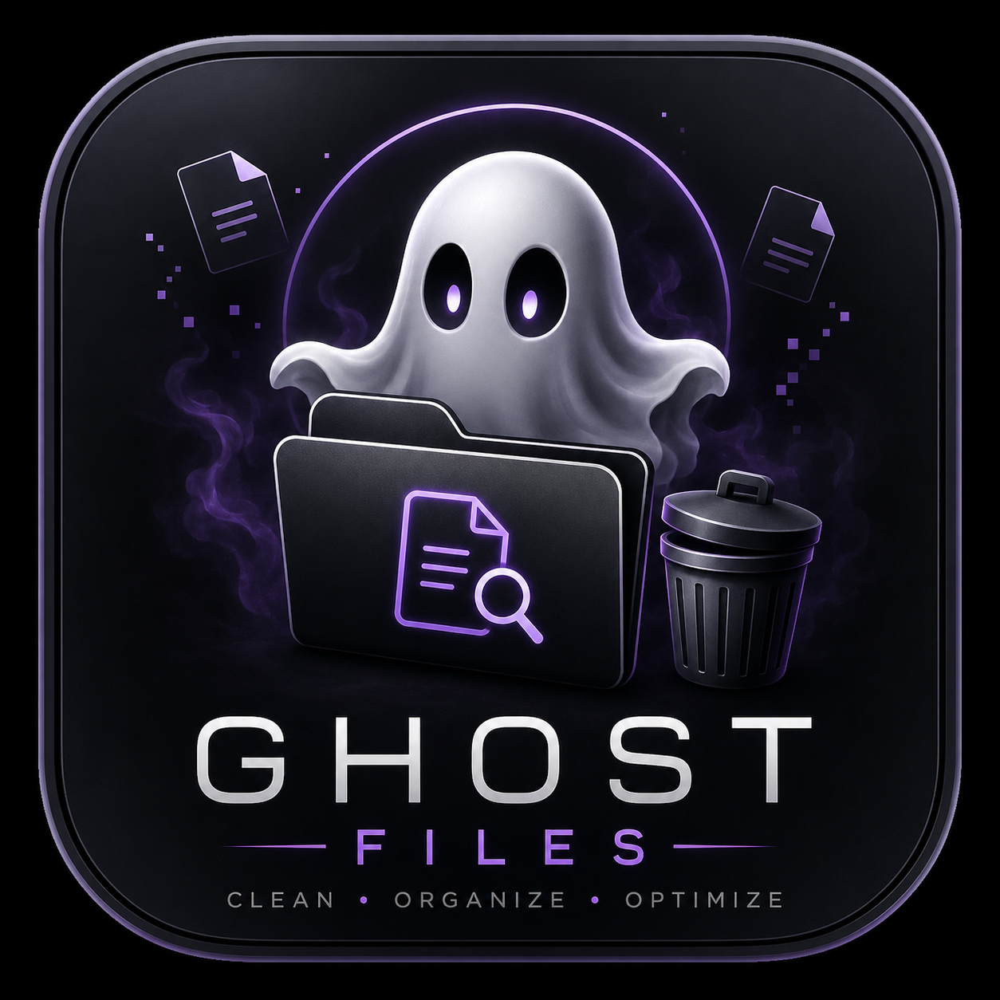

# Ghost Files

<p align="center">
  
</p>

<h3 align="center">Find the files your system forgot about.</h3>

<p align="center">
  A lightweight desktop utility for finding unnecessary, duplicate, temporary, and large files.
</p>

<p align="center">
  <a href="https://github.com/Pavn31/GhostFiles/releases/latest">
    
  </a>
  
  
  
  
</p>

---

## Overview

**Ghost Files** is a lightweight cross-platform desktop application built with **Python and PySide6**.

It scans a selected folder and identifies files that may be unnecessary, duplicated, temporary, or consuming significant storage.

Ghost Files is designed around a simple idea:

> Find unnecessary files without permanently deleting them.

Selected files are moved to the operating system's **Trash / Recycle Bin** instead of being permanently deleted.

---

## Features

### Ghost File Detection

Ghost Files can identify potentially unnecessary files including:

- Empty files
- Temporary files
- Backup files
- Old files
- Swap files
- Suspicious filenames

Supported extensions include:

```text
.tmp
.bak
.old
.swp
```

Suspicious filename keywords include:

```text
backup
temp
old
```

### Duplicate Detection

Ghost Files detects duplicate files using a two-stage process:

1. Files are grouped by size.
2. Files with matching sizes are verified using SHA-256 hashing.

Only files with matching hashes are considered duplicates.

The application displays:

- Duplicate groups
- Number of identical files
- File paths
- Estimated wasted storage

This avoids unnecessarily hashing every file during a scan.

### Large File Detection

Ghost Files identifies files equal to or larger than the configured large-file threshold.

Current threshold:

```text
10 MB
```

The threshold can be changed in `main.py`.

### Safe Trash / Recycle Bin

Ghost Files does not permanently delete selected files.

**Linux**

Files are moved to the Linux Trash.

The application uses:

```text
gio trash
```

when available, with a fallback to the standard user Trash directory.

**Windows**

Files are moved to the Windows Recycle Bin using:

```text
send2trash
```

This provides a safer cleanup workflow than directly deleting files.

### Project Health Score

Ghost Files calculates a simple health score based on detected:

- Ghost files
- Duplicate files
- Large files

The score provides a quick overview of the selected folder's cleanup state.

### Interface

The application includes:

- Folder selection
- Folder scanning
- File statistics
- Project health score
- Ghost file detection
- Duplicate detection
- Large file detection
- File selection
- Safe Trash / Recycle Bin support
- Automatic rescanning
- Cross-platform support

---

## Screenshots

### Main Dashboard

*Add screenshot here.*

### Ghost Detection

*Add screenshot here.*

### Duplicate Detection

*Add screenshot here.*

### Large File Detection

*Add screenshot here.*

---

## Download

The latest stable release is available on GitHub.

**Current version:** v1.0.0

### Linux

Download:

```text
GhostFiles-Linux.tar.gz
```

Extract the archive:

```bash
tar -xzf GhostFiles-Linux.tar.gz
```

Enter the directory:

```bash
cd GhostFiles
```

Make the executable executable:

```bash
chmod +x GhostFiles
```

Run:

```bash
./GhostFiles
```

The `_internal` directory must remain alongside the executable.

Expected structure:

```text
GhostFiles/
├── GhostFiles
└── _internal/
```

### Windows

Download:

```text
GhostFiles-Windows.zip
```

Extract the ZIP file.

Open the extracted `GhostFiles` directory and run:

```text
GhostFiles.exe
```

The `_internal` directory must remain alongside `GhostFiles.exe`.

Expected structure:

```text
GhostFiles/
├── GhostFiles.exe
└── _internal/
```

---

## Installation From Source

### Linux

Clone the repository:

```bash
git clone https://github.com/Pavn31/GhostFiles.git
cd GhostFiles
```

Create a virtual environment:

```bash
python -m venv .venv
```

Activate it:

```bash
source .venv/bin/activate
```

Install dependencies:

```bash
pip install -r requirements.txt
```

Run the application:

```bash
python main.py
```

### Windows

Clone the repository:

```bash
git clone https://github.com/Pavn31/GhostFiles.git
cd GhostFiles
```

Create a virtual environment:

```bash
py -m venv .venv
```

Activate it:

```bash
.venv\Scripts\activate
```

Install dependencies:

```bash
pip install -r requirements.txt
```

Run:

```bash
python main.py
```

---

## Requirements

### Runtime

**Linux**

- Linux distribution
- Python 3.x
- PySide6
- `gio` recommended for Trash integration

**Windows**

- Windows 10 or newer
- Python 3.x
- PySide6
- send2trash

### Dependencies

`requirements.txt`:

```text
PySide6
send2trash
```

---

## Building From Source

### Linux

Install PyInstaller:

```bash
pip install pyinstaller
```

Build:

```bash
pyinstaller --noconfirm --clean --windowed --name GhostFiles main.py
```

The packaged application will be created at:

```text
dist/GhostFiles/
```

Structure:

```text
dist/
└── GhostFiles/
    ├── GhostFiles
    └── _internal/
```

### Windows

Install dependencies:

```bash
pip install -r requirements.txt
pip install pyinstaller
```

Build:

```bash
pyinstaller --noconfirm --clean --windowed --name GhostFiles main.py
```

Output:

```text
dist/
└── GhostFiles/
    ├── GhostFiles.exe
    └── _internal/
```

---

## Automated Windows Builds

Ghost Files uses GitHub Actions to build the Windows version.

Workflow:

```text
.github/
└── workflows/
    └── build-windows.yml
```

The workflow runs on a Windows runner and:

1. Checks out the repository.
2. Installs Python.
3. Installs project dependencies.
4. Installs PyInstaller.
5. Builds the Windows application.
6. Uploads the Windows build as an artifact.

This allows the Windows executable to be built without requiring a local Windows development machine.

---

## Linux Desktop Launcher

Ghost Files can be added to the Linux application menu using a `.desktop` launcher.

Example:

```ini
[Desktop Entry]
Name=Ghost Files
Comment=Find and clean unnecessary files
Exec=/home/USERNAME/GhostFiles/dist/GhostFiles/GhostFiles
Icon=/home/USERNAME/GhostFiles/assets/ghost-files.png
Terminal=false
Type=Application
Categories=Utility;
StartupNotify=true
```

Replace `USERNAME` with your Linux username.

---

## How It Works

```text
                    Selected Folder
                           │
                           ▼
                      Scan Files
                           │
             ┌─────────────┼─────────────┐
             │             │             │
             ▼             ▼             ▼
      Ghost Detection  Large Files  Duplicate Detection
             │             │             │
             │             │             ▼
             │             │       Group By Size
             │             │             │
             │             │             ▼
             │             │        SHA-256 Hash
             │             │             │
             └─────────────┼─────────────┘
                           │
                           ▼
                    Results Dashboard
                           │
                           ▼
                      Select File
                           │
                           ▼
                    Move to Trash
                           │
                ┌──────────┴──────────┐
                ▼                     ▼
              Linux                 Windows
                │                     │
                ▼                     ▼
          Linux Trash            Recycle Bin
```

---

## Detection Logic

### Empty Files

Files with a size of:

```text
0 bytes
```

are classified as empty files.

### Temporary Files

Known temporary extensions are detected automatically:

```text
.tmp
.bak
.old
.swp
```

### Suspicious Filenames

Files containing configured keywords such as:

```text
backup
temp
old
```

can be flagged.

### Duplicate Files

Duplicate detection follows this process:

```text
Files
 │
 ▼
Group by Size
 │
 ▼
Matching Size?
 │
 ▼
SHA-256 Hash
 │
 ▼
Matching Hash?
 │
 ▼
Duplicate Group
```

Files must have both:

- Matching file size
- Matching SHA-256 hash

to be considered duplicates.

### Large Files

Files equal to or larger than:

```text
LARGE_FILE_SIZE
```

are displayed in the Large Files section.

The current threshold is:

```text
10 MB
```

---

## Safety

Ghost Files moves selected files to the operating system's Trash or Recycle Bin rather than permanently deleting them.

However, users should still review detected files before moving them.

**Do not blindly remove files from system directories.**

Ghost Files is intended primarily for user-selected folders and personal storage cleanup.

---

## Project Structure

```text
GhostFiles/
├── .github/
│   └── workflows/
│       └── build-windows.yml
├── assets/
│   └── ghost-files.png
├── main.py
├── GhostFiles.spec
├── README.md
├── requirements.txt
└── .gitignore
```

Generated directories such as:

```text
build/
dist/
.venv/
```

are excluded from Git.

---

## Tech Stack

| Technology | Purpose |
|---|---|
| Python | Application logic |
| PySide6 | Desktop GUI |
| pathlib | File system operations |
| SHA-256 | Duplicate detection |
| subprocess | Linux system integration |
| send2trash | Trash / Recycle Bin integration |
| PyInstaller | Application packaging |
| GitHub Actions | Automated Windows builds |

---

## Current Status

**Version 1.0.0**

**Status:** Initial Public Release

### Implemented

- [x] Folder scanning
- [x] Empty file detection
- [x] Temporary file detection
- [x] Suspicious filename detection
- [x] Ghost file detection
- [x] Duplicate detection
- [x] SHA-256 duplicate verification
- [x] Duplicate wasted-space calculation
- [x] Large file detection
- [x] Project health score
- [x] File selection
- [x] Linux Trash support
- [x] Windows Recycle Bin support
- [x] Automatic rescanning
- [x] PyInstaller packaging
- [x] Linux executable
- [x] Windows executable
- [x] GitHub Actions Windows build
- [x] Desktop launcher support
- [x] Custom application icon
- [x] Public GitHub release

### Roadmap

Possible future improvements:

- [ ] Configurable detection thresholds
- [ ] Scan exclusions
- [ ] Recursive scan controls
- [ ] File preview
- [ ] Sorting and filtering
- [ ] Scan history
- [ ] Storage analytics
- [ ] Improved health scoring
- [ ] More Linux desktop integration
- [ ] Improved Windows integration
- [ ] Portable packaging improvements
- [ ] Installer packages
- [ ] Additional cleanup categories

---

## Contributing

Contributions, suggestions, and bug reports are welcome.

When reporting a bug, include:

- Operating system
- Ghost Files version
- Python version, if running from source
- Steps to reproduce
- Relevant error output

---

## License

This project is licensed under the MIT License.

---

## Author

**Pavan**

GitHub: [https://github.com/Pavn31](https://github.com/Pavn31)
