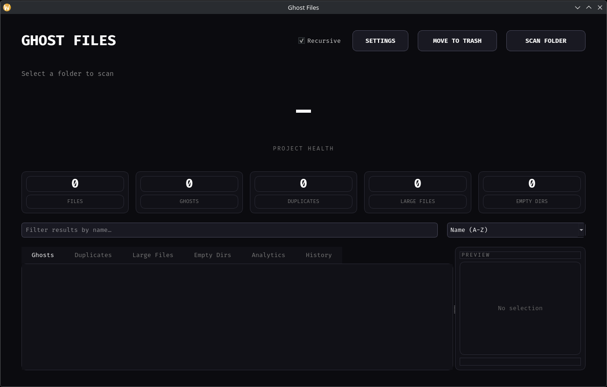

<h1 align="center">Ghost Files</h1>

<p align="center">
  
</p>

<p align="center">
  <strong>A lightweight cross-platform file-analysis and cleanup utility.</strong>
</p>

<p align="center">
  Detect ghost files, duplicates, large files, cache directories, logs, empty folders, and broken symbolic links.
</p>

<p align="center">
  <a href="https://github.com/Pavn31/GhostFiles/releases/latest">Latest Release</a> ·
  <a href="https://github.com/Pavn31/GhostFiles/issues">Issues</a>
</p>

---

## Overview

Ghost Files is a desktop utility that analyzes folders and identifies files and directories that may be unnecessary, duplicated, outdated, or consuming significant storage.

It provides a graphical interface built with **Python** and **PySide6**, with configurable detection rules, scan exclusions, recursive scanning, duplicate detection, storage analytics, health scoring, and desktop integration.

The project is designed to stay simple, lightweight, and useful for everyday storage maintenance.

---

## Features

### File Detection

- Ghost file detection
- Temporary file detection
- Backup and old file detection
- Log file detection
- Cache directory detection
- Empty directory detection
- Broken symbolic-link detection
- Large-file detection
- Duplicate-file detection

### Scanning

- Configurable detection thresholds
- Recursive scan controls
- Scan exclusions
- File and folder pattern exclusions
- Fast directory traversal
- Size-based duplicate pre-filtering
- SHA-256 duplicate verification
- Permission-error handling
- Large-folder support

### File Analysis

- File preview
- File size information
- Sorting and filtering
- Duplicate group analysis
- Extension statistics
- Storage analytics
- Duplicate wasted-space calculation

### History & Health

- Scan history and historical scan results
- Configurable health-score weights
- Improved health scoring
- Statistics for total files, ghost files, duplicates, large files, and empty directories

### Selection & Cleanup

- Checkbox-based multi-file selection
- **SELECT ALL** and **CLEAR** controls
- Selected file count and total selected size
- Selection persistence while sorting and re-rendering
- Bulk **Move to Trash**
- Confirmation dialog before bulk cleanup
- Safe trash-based deletion (Linux and Windows)
- Configurable detection categories

### UI & Desktop Integration

- Improved dark UI with refined spacing, typography, buttons, and result lists
- File preview panel
- Filtering and sorting controls
- Linux desktop entry installation
- Windows desktop shortcut creation
- Linux desktop notifications
- Windows integration
- Cross-platform packaging via GitHub Actions (Windows, Linux, macOS)

---

## Dashboard

<p align="center">
  
</p>

The dashboard gives a quick overview of:

- Total files scanned
- Detected ghost files
- Duplicate files
- Large files
- Empty directories
- Storage usage
- Health score
- Scan history

---

## Supported Platforms

| Platform | Status    |
|----------|-----------|
| Linux    | Supported |
| Windows  | Supported |
| macOS    | Supported |

Pre-built **v2.0** binaries are generated through GitHub Actions for all three platforms.

---

## Requirements

**Python 3.10+** is recommended.

### Dependencies

```bash
pip install PySide6
```

For Windows trash and shortcut integration:

```bash
pip install send2trash pywin32 winshell
```

Linux desktop integration may use the following tools, which are normally provided by your desktop environment or distribution packages:

- `gio`
- `notify-send`
- `update-desktop-database`

---

## Running From Source

Clone the repository:

```bash
git clone https://github.com/Pavn31/GhostFiles.git
cd GhostFiles
```

Install dependencies:

```bash
python -m pip install PySide6
```

Run:

```bash
python main.py
```

---

## Building

Ghost Files uses **PyInstaller** for packaging.

**Linux**

```bash
./build_linux.sh
```

**Windows** (run on Windows)

```bat
build_windows.bat
```

**macOS** (run on macOS)

```bash
./build_macos.sh
```

### GitHub Actions

The repository includes `.github/workflows/build.yml`, which builds Ghost Files on Ubuntu, Windows, and macOS. This provides platform-specific builds without needing every operating system locally.

---

## Configuration

Ghost Files stores its data in your home directory:

| File                        | Purpose                 |
|-----------------------------|-------------------------|
| `~/.ghostfiles/config.json`  | User configuration      |
| `~/.ghostfiles/history.json` | Scan history            |

Both files are created automatically when required.

### Detection Settings

**Large File Threshold** — minimum size for a file to be classified as large.

```text
100 MB
```

**Ghost Extensions** (defaults)

```text
.tmp
.bak
.old
.swp
```

**Ghost Keywords** (defaults)

```text
backup
temp
old
```

**Log Extensions**

```text
.log
```

**Cache Directories**

```text
__pycache__
.cache
node_modules
.pytest_cache
.mypy_cache
```

### Scan Exclusions

Folders and files can be excluded from scanning. Default exclusions include:

```text
.git
node_modules
__pycache__
.venv
venv
.cache
Thumbs.db
```

Custom patterns can also be added:

```text
*.iso
build
dist
node_modules
```

### Recursive Scanning

Ghost Files supports both **top-level** and **recursive** scans. Recursive scanning analyzes nested directories while respecting configured exclusions.

---

## How It Works

### Duplicate Detection

Duplicate detection uses a two-stage approach:

1. **File size** — files are grouped by size first. Files with a unique size cannot be duplicates, so they are never hashed.
2. **SHA-256** — only files sharing the same size are hashed and compared.

This avoids unnecessary hashing and keeps scans fast on large directory trees.

```text
File
 ↓
Read metadata
 ↓
Collect size
 ↓
Group by size
 ↓
Only matching-size files
 ↓
SHA-256 verification
 ↓
Duplicate groups
```

> Very large directories can still take time, because the application must inspect the underlying filesystem.

### Health Score

The health score is calculated from:

- Ghost-file ratio
- Duplicate wasted-space ratio
- Large-file ratio

Weights can be configured in **Settings**. The score is normalized to **0 – 100**, where a higher score means a cleaner storage state.

### Storage Analytics

The analytics section can display:

- File counts and sizes
- Extension statistics
- Duplicate waste
- Large-file usage
- Storage distribution

### File Preview

Previews are supported for common text and image formats.

**Text:** `.txt` `.md` `.py` `.json` `.yaml` `.yml` `.ini` `.cfg` `.csv` `.log` `.xml` `.html` `.css` `.js` `.ts` `.sh` `.c` `.cpp` `.h` `.java` `.rs` `.go` `.rb` `.toml`

**Images:** `.png` `.jpg` `.jpeg` `.gif` `.bmp` `.webp`

### Scan History

Ghost Files keeps a local history of recent scans. Each entry can contain:

- Folder scanned
- Scan timestamp
- Total files
- Ghost files
- Duplicate files
- Large files
- Health score

Only the most recent entries are kept.

---

## Cleanup & Selection Workflow

Detected files are moved to the system trash instead of being permanently deleted, which makes cleanup safer.

- **Linux:** uses `gio trash`
- **Windows:** uses the Windows-compatible trash mechanism

Ghost Files v2.0 introduces checkbox-based selection for result lists:

```text
Scan Folder
     ↓
Review Results
     ↓
Check Files
     ↓
SELECT ALL / CLEAR as needed
     ↓
Review Selected Count + Size
     ↓
MOVE TO TRASH
     ↓
Confirm
```

Selections are preserved when results are re-rendered, including after sorting.

---

## Desktop Integration

**Linux** — Ghost Files can install a desktop entry into `~/.local/share/applications/` and can send desktop notifications.

**Windows** — Ghost Files can create a desktop shortcut and provides Windows-specific integration.

---

## Project Structure

```text
GhostFiles/
├── assets/
│   ├── ghost-files.png
│   ├── main-dashboard.png
│   └── ...
│
├── main.py
├── README.md
├── .gitignore
└── ...
```

---

## Technology Stack

| Technology   | Purpose                      |
|--------------|------------------------------|
| Python       | Application logic            |
| PySide6      | Desktop GUI                  |
| `pathlib`    | File-system operations       |
| `hashlib`    | SHA-256 hashing              |
| JSON         | Configuration and history    |
| `subprocess` | Platform integration         |
| `shutil`     | File operations              |
| PyInstaller  | Application packaging        |

---

## Releases

### Version History

| Version | Status   | Highlights                                                                                              |
|---------|----------|---------------------------------------------------------------------------------------------------------|
| v2.0    | Current  | UI improvements, checkbox selection, bulk cleanup, selection persistence, Windows/Linux/macOS builds    |
| v1.1.0  | Previous | Performance, scanning, duplicate detection, configuration, analytics, preview, history, desktop integration |
| v1.0.0  | Previous | Initial stable release                                                                                  |

### v1.1.0 Highlights

- Improved scanning performance
- Improved and optimized duplicate detection
- Configurable scanning behaviour
- Improved health scoring
- Scan exclusions and recursive scanning controls
- File preview, sorting, and filtering
- Scan history and storage analytics
- Desktop and Windows integration improvements
- Portable packaging improvements
- Additional cleanup categories

### Downloads

| Platform | File                        |
|----------|-----------------------------|
| Linux    | `GhostFiles-Linux.tar.gz`   |
| Windows  | `GhostFiles-Windows.zip`    |

➡️ [Download the latest Ghost Files release](https://github.com/Pavn31/GhostFiles/releases/latest)

---

## Roadmap

- More Linux desktop integration
- Improved Windows integration
- Installer packages
- Portable packaging improvements
- Additional cleanup categories
- Further scanning optimizations
- Improved file analysis
- Additional preview formats
- More storage analytics
- UI improvements
- More platform-specific integrations

---

## Safety

Ghost Files is an analysis and cleanup utility. Before deleting anything:

1. Review the detected item.
2. Confirm that it is unnecessary.
3. Check its location.
4. Use the trash-based cleanup mechanism whenever possible.

⚠️ Do not delete system files or files whose purpose you do not understand.

---

## Development

Check the repository status:

```bash
git status
```

Run syntax validation:

```bash
python -m py_compile main.py
```

Run the application:

```bash
python main.py
```

---

## Contributing

Contributions, bug reports, feature requests, and improvements are welcome.

Before submitting a pull request:

- Test the application.
- Check for Python syntax errors.
- Keep changes focused.
- Update documentation when required.

---

## License

This project is currently maintained by [Pavn31](https://github.com/Pavn31). See the repository for the current licensing information.

---

## Author

**Pavan Badiger**
GitHub: [https://github.com/Pavn31](https://github.com/Pavn31)

---

<p align="center">
  Built with Python, PySide6, and a lot of filesystem scanning.
</p>
