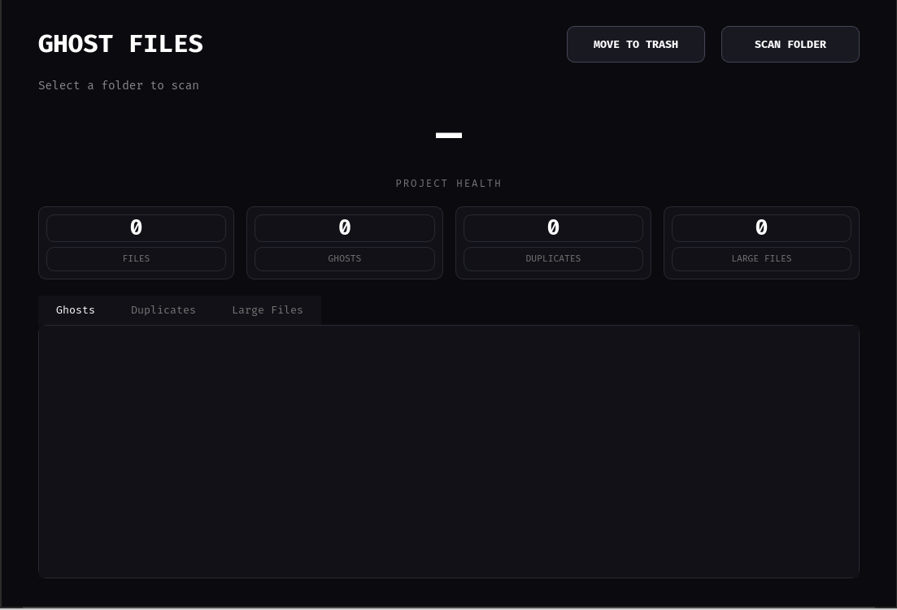

Pasted code(4).py
Python
i changed 10 to 100

Pasted code(5).py
Python

Screenshot_20260823_102825.png

Screenshot_20260823_103540.png
scanning is slow lets make it fast

Pasted code(6).py
Python

make changes and give me whole code

Pasted code(7).py
Python

Screenshot_20260823_104630.png
le bhai le large folders ko thoda time lagega

Perfect. Ghost Files v1.1.0 is fully released.

Assets are both attached:

Linux: GhostFiles-Linux.tar.gz — 83.50 MiB

Windows: GhostFiles-Windows.zip — 47.95 MiB

And the release is live at:

Ghost Files v1.1.0 on GitHub

So the release pipeline is done: code → tag → GitHub release → Linux + Windows builds.

Pasted markdown(4).md
File
update this README.md

I need the actual README.md file. The uploaded file I found is a Prettier log, not the GhostFiles README.

Please upload the current README.md here. Then I’ll update it directly for v1.1.0, including:

v1.1.0 release section

Linux + Windows downloads

New detection/configuration features

Configurable thresholds

Scan exclusions

Recursive scanning

File preview

Sorting/filtering

Scan history

Storage analytics

Improved health scoring

Linux/Windows integration

Portable packaging

Cleanup categories

Current release links

I won't rewrite unrelated sections or change your existing structure unnecessarily.

Pasted markdown(5).md
File
here is the file

Done. I updated the README for Ghost Files v1.1.0, including the new features, release assets, current status, roadmap cleanup, and updated project structure.

Download the updated README.md 

README.md
Document

Library
/
README.md

Ghost Files

  

<h3 align="center">Find the files your system forgot about.</h3>

 A lightweight desktop utility for finding unnecessary, duplicate, temporary, and large files. 

      

Overview
Ghost Files is a lightweight cross-platform desktop application built with Python and PySide6.

It scans a selected folder and identifies files that may be unnecessary, duplicated, temporary, or consuming significant storage.

Ghost Files is designed around a simple idea:

Find unnecessary files without permanently deleting them.

Selected files are moved to the operating system's Trash / Recycle Bin instead of being permanently deleted.

Releases
Version	Status	Release
v1.1.0	Latest	View Release
v1.0.0	Previous	View Release
Latest Release — v1.1.0
Ghost Files v1.1.0 includes improved scanning, configurable detection, better cleanup controls, file preview, sorting/filtering, scan history, storage analytics, improved health scoring, and stronger desktop integration.

Release Assets
Linux: GhostFiles-Linux.tar.gz

Windows: GhostFiles-Windows.zip

Download Ghost Files v1.1.0

Features
Ghost File Detection
Ghost Files can identify potentially unnecessary files including:

Empty files

Temporary files

Backup files

Old files

Swap files

Suspicious filenames

Log files

Cache directories

Broken symbolic links

Supported extensions include:

.tmp
.bak
.old
.swp
.log
Suspicious filename keywords can also be configured.

Duplicate Detection
Ghost Files detects duplicate files using a two-stage process:

Files are grouped by size.

Files with matching sizes are verified using SHA-256 hashing.

Only files with matching hashes are considered duplicates.

The application displays:

Duplicate groups

Number of identical files

File paths

Estimated wasted storage

This avoids unnecessarily hashing every file during a scan.

Large File Detection
Ghost Files identifies files equal to or larger than the configured large-file threshold.

The default threshold is:

100 MB
The threshold can be changed from the application's settings.

Configurable Detection Thresholds
Detection behaviour can be customized through the Settings panel, including:

Large-file threshold

Ghost-file extensions

Suspicious filename keywords

Log-file extensions

Cache-folder names

Health-score weights

Scan Exclusions
Users can exclude folders or file-name patterns from scans.

Examples:

.git
node_modules
__pycache__
.venv
*.iso
build
Recursive Scan Controls
Ghost Files supports:

Top-level folder scanning

Recursive scanning through subdirectories

This can be configured from the application.

File Preview
Supported text and image files can be previewed directly from the application before cleanup.

Text formats include common source-code, configuration, markup, and documentation files.

Image formats include common PNG, JPEG, GIF, BMP, and WebP files.

Sorting and Filtering
Detected files can be organized using sorting and filtering controls, making large scan results easier to inspect.

Scan History
Ghost Files keeps a local history of previous scans, including:

Scanned folder

Scan timestamp

Total files

Detected ghost files

Duplicate count

Large-file count

Health score

History is stored locally under:

~/.ghostfiles/
Storage Analytics
The application provides storage statistics including:

Total scanned files

Total storage usage

Duplicate wasted space

Large-file counts

Extension-based storage statistics

Cleanup Categories
Detection categories can be enabled or disabled independently:

Cache folders

Log files

Empty folders

Broken symbolic links

Additional cleanup categories can be added through future releases.

Improved Project Health Score
Ghost Files calculates a weighted health score based on:

Ghost-file ratio

Duplicate wasted-space ratio

Large-file ratio

The score provides a quick overview of the selected folder's cleanup state.

Safe Trash / Recycle Bin
Ghost Files does not permanently delete selected files.

Linux

Files are moved to the Linux Trash using:

gio trash
when available, with a fallback to the standard user Trash directory.

Windows

Files are moved to the Windows Recycle Bin using:

send2trash
This provides a safer cleanup workflow than directly deleting files.

Desktop Integration
Ghost Files includes platform-specific integration features.

Linux

Desktop entry installation

Application menu integration

Custom application icon

Linux Trash integration

Windows

Desktop shortcut creation

Windows Recycle Bin integration

Portable executable packaging

Interface
The application includes:

Folder selection

Folder scanning

File statistics

Project health score

Ghost file detection

Duplicate detection

Large file detection

File preview

Sorting and filtering

Scan history

Storage analytics

File selection

Safe Trash / Recycle Bin support

Automatic rescanning

Cross-platform support

Screenshots
Main Dashboard

  

Download
The latest stable release is available on GitHub.

Current version: v1.1.0

Linux
Download:

GhostFiles-Linux.tar.gz
Extract the archive:

tar -xzf GhostFiles-Linux.tar.gz
Enter the directory:

cd GhostFiles
Make the executable executable:

chmod +x GhostFiles
Run:

./GhostFiles
The _internal directory must remain alongside the executable.

Expected structure:

GhostFiles/
├── GhostFiles
└── _internal/
Windows
Download:

GhostFiles-Windows.zip
Extract the ZIP file.

Open the extracted GhostFiles directory and run:

GhostFiles.exe
The _internal directory must remain alongside GhostFiles.exe.

Expected structure:

GhostFiles/
├── GhostFiles.exe
└── _internal/
Installation From Source
Linux
Clone the repository:

git clone https://github.com/Pavn31/GhostFiles.git
cd GhostFiles
Create a virtual environment:

python -m venv .venv
Activate it:

source .venv/bin/activate
Install dependencies:

pip install -r requirements.txt
Run the application:

python main.py
Windows
Clone the repository:

git clone https://github.com/Pavn31/GhostFiles.git
cd GhostFiles
Create a virtual environment:

py -m venv .venv
Activate it:

.venv\Scripts\activate
Install dependencies:

pip install -r requirements.txt
Run:

python main.py
Requirements
Runtime
Linux

Linux distribution

Python 3.x

PySide6

gio recommended for Trash integration

Windows

Windows 10 or newer

Python 3.x

PySide6

send2trash

Dependencies
requirements.txt:

PySide6
send2trash
Building From Source
Linux
Install PyInstaller:

pip install pyinstaller
Build:

pyinstaller --noconfirm --clean --windowed --name GhostFiles main.py
The packaged application will be created at:

dist/GhostFiles/
Structure:

dist/
└── GhostFiles/
    ├── GhostFiles
    └── _internal/
Windows
Install dependencies:

pip install -r requirements.txt
pip install pyinstaller
Build:

pyinstaller --noconfirm --clean --windowed --name GhostFiles main.py
Output:

dist/
└── GhostFiles/
    ├── GhostFiles.exe
    └── _internal/
Automated Windows Builds
Ghost Files uses GitHub Actions to build the Windows version.

Workflow:

.github/
└── workflows/
    └── build-windows.yml
The workflow runs on a Windows runner and:

Checks out the repository.

Installs Python.

Installs project dependencies.

Installs PyInstaller.

Builds the Windows application.

Uploads the Windows build as an artifact.

This allows the Windows executable to be built without requiring a local Windows development machine.

Linux Desktop Launcher
Ghost Files can be added to the Linux application menu using the built-in desktop integration.

The application can create a desktop entry from:

Settings → Desktop Integration
The generated launcher uses the installed Ghost Files executable and application icon.

How It Works
                     Selected Folder
                            │
                            ▼
                       Scan Files
                            │
              ┌─────────────┼─────────────┐
              │             │             │
              ▼             ▼             ▼
       Ghost Detection  Large Files  Duplicate Detection
              │             │             │
              │             │             ▼
              │             │       Group By Size
              │             │             │
              │             │             ▼
              │             │        SHA-256 Hash
              │             │             │
              └─────────────┼─────────────┘
                            │
                            ▼
                     Results Dashboard
                            │
                            ▼
                       Select File
                            │
                            ▼
                     Move to Trash
                            │
                 ┌──────────┴──────────┐
                 ▼                     ▼
               Linux                 Windows
                 │                     │
                 ▼                     ▼
           Linux Trash            Recycle Bin
Detection Logic
Empty Files
Files with a size of:

0 bytes
are classified as empty files.

Temporary Files
Known temporary extensions are detected automatically:

.tmp
.bak
.old
.swp
Suspicious Filenames
Files containing configured keywords such as:

backup
temp
old
can be flagged.

Cache Directories
Configured cache directory names can be detected as cleanup candidates.

Examples:

__pycache__
.cache
node_modules
.pytest_cache
.mypy_cache
Log Files
Configured log extensions can be detected as cleanup candidates.

Default example:

.log
Broken Symbolic Links
Broken symbolic links can be detected without following them as normal files.

Duplicate Files
Duplicate detection follows this process:

Files
 │
 ▼
Group by Size
 │
 ▼
Matching Size?
 │
 ▼
SHA-256 Hash
 │
 ▼
Matching Hash?
 │
 ▼
Duplicate Group
Files must have both:

Matching file size

Matching SHA-256 hash

to be considered duplicates.

Large Files
Files equal to or larger than the configured threshold are displayed in the Large Files section.

Default:

100 MB
Safety
Ghost Files moves selected files to the operating system's Trash or Recycle Bin rather than permanently deleting them.

However, users should still review detected files before moving them.

Do not blindly remove files from system directories.

Ghost Files is intended primarily for user-selected folders and personal storage cleanup.

Project Structure
GhostFiles/
├── .github/
│   └── workflows/
│       └── build-windows.yml
├── assets/
│   ├── ghost-files.png
│   └── Main-Dashboard.png
├── main.py
├── GhostFiles.spec
├── README.md
├── requirements.txt
└── .gitignore
Generated directories such as:

build/
dist/
.venv/
are excluded from Git.

Release archives such as:

GhostFiles-Linux.tar.gz
GhostFiles-Windows.zip
are distributed through GitHub Releases rather than committed to the repository.

Tech Stack
Technology	Purpose
Python	Application logic
PySide6	Desktop GUI
pathlib	File system operations
SHA-256	Duplicate detection
subprocess	Linux system integration
send2trash	Trash / Recycle Bin integration
PyInstaller	Application packaging
GitHub Actions	Automated Windows builds
Current Status
Version 1.1.0

Status: Latest Public Release

Implemented
Folder scanning

Recursive scan controls

Configurable detection thresholds

Scan exclusions

Empty file detection

Temporary file detection

Suspicious filename detection

Cache folder detection

Log file detection

Broken symbolic link detection

Ghost file detection

Duplicate detection

SHA-256 duplicate verification

Duplicate wasted-space calculation

Large file detection

File preview

Sorting and filtering

Scan history

Storage analytics

Improved project health score

Configurable health-score weights

File selection

Linux Trash support

Windows Recycle Bin support

Automatic rescanning

PyInstaller packaging

Linux executable

Windows executable

GitHub Actions Windows build

Linux desktop integration

Windows desktop shortcut support

Custom application icon

Portable Linux packaging

Portable Windows packaging

Public GitHub release

Roadmap
Possible future improvements:

Installer packages

Additional cleanup categories

More advanced storage visualizations

Further scanning performance improvements

Expanded desktop integration

Additional platform support

Contributing
Contributions, suggestions, and bug reports are welcome.

When reporting a bug, include:

Operating system

Ghost Files version

Python version, if running from source

Steps to reproduce

Relevant error output

Author
Pavan

GitHub: https://github.com/Pavn31

